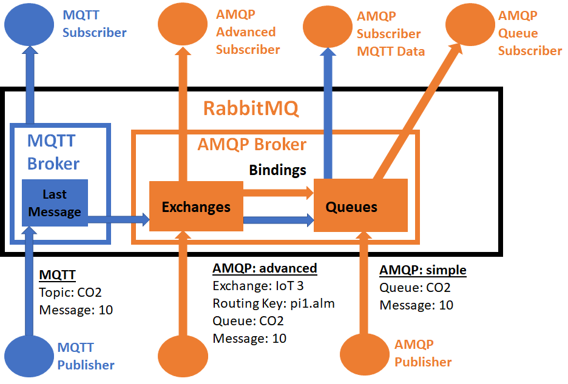
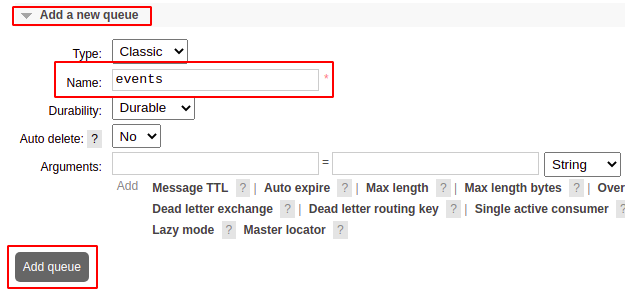
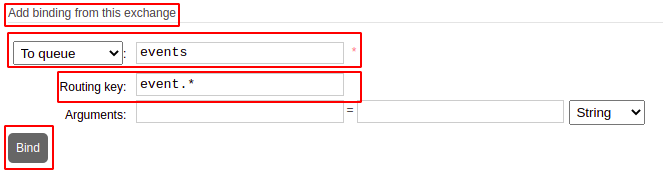
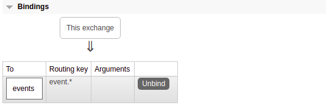
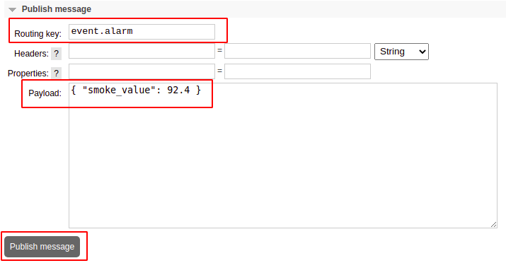
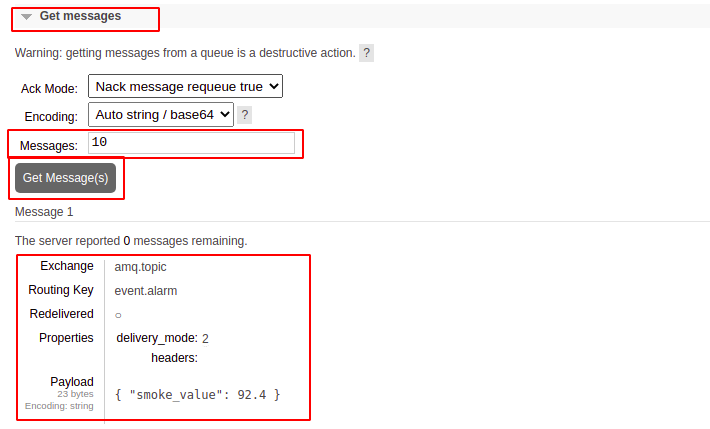
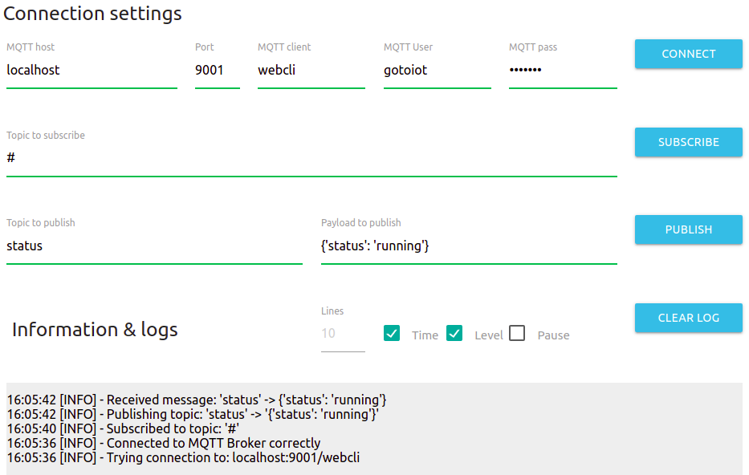

<a href="https://www.gotoiot.com/">
    
</a>

Service AMQP Broker
===================

*Ayudaría mucho si apoyaras este proyecto con una ⭐ en Github!*

AMQP es un protocolo de colas que define el comportamiento de un servidor basado en exchanges y queues, que permite vincular a diferentes aplicaciones en múltiples lenguajes de programación, tanto internas como de terceros, mediante un `Mensaje AMQP` que representa la unidad de información a intercambiar.

RabbitMQ es un broker que implementa la especificación `AMQP 0-9-1`, y además de soportar el comportamiento estandar del protocolo, posee extensiones a modo plugins donde se pueden interconectar diferentes protocolos como MQTT, MQTT sobre WebSockets, STOMP, HTTP, y más. Además cuenta con un administrador web que lo hace muy conveniente para configurarlo.

En este proyecto, además de soportar el protocolo `AMQP 0-9-1` vamos a hacer uso de la extensión `MQTT`, que te va a permitir correr un broker MQTT que se vinculará al broker RabbitMQ y permitirá conectar dispositivos con recursos limitados - como microcontroladores - con un protocolo altamente escalable, donde podrá intercambiar información con otros servicios y dispositivos.

Para que tengas una idea más clara sobre RabbitMQ y su configuración orientada a proyectos IoT, en esta imagen podés ver la arquitectura de la aplicación, y cómo poder conectar un dispositivo mediante MQTT e integrarlo dentro del ecosistema RabbitMQ.



> Para que entiendas el alcance de este proyecto, es recomendable que leas la [Introducción a AMQP](https://www.gotoiot.com/pages/articles/amqp_intro/index.html) y la [Introducción a RabbitMQ](https://www.gotoiot.com/pages/articles/rabbitmq_intro/index.html) que se encuentran publicadas en nuestra web.

## Instalar las dependencias 🔩

Para correr este proyecto es necesario que instales `Docker` y `Docker Compose`. 

<details><summary><b>Mira cómo instalar las dependencias</b></summary><br>

En [este documento](https://www.gotoiot.com/pages/articles/docker_installation/index.html) publicado en nuestra web están los detalles para instalar Docker y Docker Compose. Si querés instalar ambas herramientas en una Raspberry Pi podés seguir [esta guía](https://devdojo.com/bobbyiliev/how-to-install-docker-and-docker-compose-on-raspberry-pi) que muestra todos los detalles de instalación.

En caso que tengas algún incoveniente o quieras profundizar al respecto, podes leer la documentación oficial de [Docker](https://docs.docker.com/get-docker/) y también la de [Docker Compose](https://docs.docker.com/compose/install/).

</details>

## Descargar el código 💾

Para descargar el código, lo más conveniente es que realices un `fork` de este proyecto a tu cuenta personal haciendo click en [este link](https://github.com/gotoiot/service-amqp-broker/fork). Una vez que ya tengas el fork a tu cuenta, descargalo con este comando (acordate de poner tu usuario en el link):

```
git clone https://github.com/USER/service-amqp-broker.git
```

> En caso que no tengas una cuenta en Github podes clonar directamente este repo.

## Ejecutar la aplicación 🚀

Cuando tengas el código descargado, desde una terminal en la raíz del proyecto ejecuta el comando `docker-compose up -d` que se va descargar la imagen de Docker del broker y ponerlo en marcha. 

Una vez que el broker inicie, espera unos momentos a que se realicen las configuraciones iniciales, y luego desde un navegador ingresa en la URL [http://localhost:15672](http://localhost:15672) que te va a llevar al portal de administración de RabbitMQ. Accede con el usuario `gotoiot` y contraseña `gotoiot`. Si pudiste accceder significa que el broker se encuentra funcionando correctamente.

Continua explorando la Información Util del proyecto para concer más detalles.

## Información útil 🔍

En esta sección vas a encontrar información que te va a servir para tener un mayor contexto.

<details><summary><b>Mira todos los detalles</b></summary>

### Configuración del servicio

El archivo `docker-compose.yml` administra los parámetros generales de ejecución del broker. Está basado en la imagen oficial de `RabbitMQ` y soporta la conexión el protocolo AMQP en el binding de puertos 5672:5672, la comunicación por MQTT en 1883:1883, MQTT por WebSockets en 9001:9001 y la comunicación para el administrador del broker por http en el puerto 15672:15672. Así mismo, si el broker viene con unos ejemplos para WebSockets configurados en el binding de puertos 9002:9002.

Así mismo, dentro del archivo `docker-compose.yml` se definen los bind volumes que se comparten con el broker. Todos se encuentran mapeados dentro del directorio `rabbitmq` y se definen de la siguiente manera:

* **enable_plugins:** En este archivo se pueden especificar los plugins habilitados por el broker. Si querés saber más al respecto podés ingresar a [este link](https://www.rabbitmq.com/plugins.html).
* **rabbitmq-env.conf**: Este es el archivo donde se comparten las variables de entorno con las que inicia el broker. Si querés saber más al respecto podés ingresar a [este link](https://www.rabbitmq.com/configure.html#customise-environment).
* **rabbitmq.conf**: Este es el archivo donde se realiza la configuración específica del broker. Para este proyecto mayormente se realiza la configuración para MQTT y también desde qué path tomar las definiciones. Si querés saber más al respecto podés ingresar a [este link](https://www.rabbitmq.com/configure.html).
* **definitions.json**: Este archivo permite crear las definiciones de todo el broker antes de comenzar su ejecución y sin tener que hacerlo manualmente. Esta característica es puntualmente útil ya que se puede compartir el entorno de ejecución del broker sin necesidad de configuraciones manuales. Si querés saber más al respecto podés ingresar a [este link](https://github.com/tyranron/lapin-issue-133-example/blob/master/rabbitmq-definitions.json).

### Definiciones en el broker

Tal como vimos en el apartado anterior, el archivo `definitions.json` tiene toda la declaración de entidades, usuarios, permisos, exchanges, queues y bindings, que se realizan de manera automática al iniciar el broker.

Esta característica resulta realmente útil para compartir la información, por lo que es recomendable que siempre que quieras realizar un proyecto lo tengas en cuenta y trates de realizarla mediante este archivo.

En [este link](https://github.com/tyranron/lapin-issue-133-example/blob/master/rabbitmq-definitions.json) podés ver un ejemplo completo de definiciones que lo podés tomar como punto de partida para realizar tus configuraciones. 

Este proyecto trae algunas definiciones preestablecidas, y podés modificarla a tus necesidades editando el archivo `definitions.json`.


### Producir y consumir mensajes

Para poder realizar una comunicación entre un productor y un consumidor es necesario que el productor se conecte a un exchange, un consumidor a una queue, y que haya un binding (routing_key) que vincule estas dos entidades.

Para este ejemplo vamos a utilizar el exchange que se crea por defecto `amq.topic` (un exchange basado en topic), una queue que se llame `events`, y un binding que vincule el exchange `amq.topic` con la queue `events` utilizando la routing key `event.*` que permitira recibir cualquier tipo de eventos que comiencen con `event.`, como por ejemplo `event.alarm`, `event.user`, pero no algo como `user.logout`.

Como primera medida debés logearte en el [admin de RabbitMQ](http://localhost:15672) con el usuario y contraseña que figuran en el archivo `definitions.json` (el usuario por defecto es `gotoiot` y contraseña `gotoiot`). Luego accedé a la pestaña `Queues` en la parte superior.

Dentro de la pestaña `Queues`, en la opción `Add a new queue` ingresa los datos como se muestran en esta imagen.



Luego, anda a la pestaña de `Exchanges`, y en la lista de exchanges disponibles hacé click sobre el exchange `amq.topic`. Dentro de la descripción del exchange, anda a la opción `Add binding from this exchange` y realiza la siguiente configuración.



Al realizar el paso anterior, dentro de los bindings deberías ver el que acabas de realizar, como en esta imagen. Tene en cuenta que podés ver mas de una queue asociada a un exchange.



Ahora que realizaste la configuración podés enviar mensajes al exchange. Dentro de la sección `Exchanges->Publish Message` realiza el envío de un mensaje como este.



Luego, anda a la pestaña Queues, y en la sección Get Messages presioná el botón para obtener los mensajes. Deberías ver una imagen como la siguiente.



### Conecxión por MQTT

La conexión por MQTT se realiza mediante el [plugin oficial de RabbitMQ](https://www.rabbitmq.com/mqtt.html). Es recomendable que leas la información para entender cómo trabaja. 

Este proyecto está pre configurado para reenviar los topics que llegan por MQTT hacia el exchange `amq.topic`; del mismo todo, todo lo que se publica en el exchange `amq.topic` que concide con la suscripción MQTT es enviado hacia los clientes respectivos. Para conectarse al broker es necesario utilizar el usuario y contraseña definidos en las variables `mqtt.default_user` y `mqtt.default_pass` en el archivo `rabbitmq.config`. 

En este ejemplo te vamos a mostrar como realizar una suscripción y publicación por MQTT usando los `Mosquitto Clients` del broker [Mosquitto](https://www.mosquitto.org) mediante un contenedor de docker. Las credenciales de acceso son las por defecto del archivo de configuración.

Abrí una terminal y ejecutá este comando para suscribirte a todos eventos (`event/#`).

```
docker run --rm --net host eclipse-mosquitto mosquitto_sub -h localhost -p 1883 -u gotoiot -P gotoiot -t event/#
```

Luego, desde otra terminal corré el siguiente comando para publicar un topic `event/failure` con el payload `'{"sensor_connected": false}'`.

```
docker run --rm --net host eclipse-mosquitto mosquitto_pub -h localhost -p 1883 -u gotoiot -P gotoiot -t event/failure -m '{"sensor_connected": false}'
```

### Conexion MQTT por WebSockets

Otra funcionalidad importante del proyecto, es que está configurado para poder conectarse al broker MQTT mediante WebSockets. Esto es una gran ventaja, ya que habilita a aplicaciones web a tener comunicación con MQTT y con el ecosistema RabbitMQ.

Para esta funcionalidad se utiliza el [plugin Web MQTT](https://www.rabbitmq.com/web-mqtt.html) provisto por el core de RabbitMQ. El puerto por defecto (sin ninguna configuración extra) para WebSockets es 15675, al cual es necesario acceder con el usuario y contraseña configurados en el archivo `rabbit/rabbitmq.config`. 

Dentro del archivo de configuración está seteado el puerto 9001 para WebSockets, aunque podés cambiarlo por cualquier otro. En caso que lo cambies, recorda configurar adecuadamente el binding de puertos de docker dentro del archivo `docker-compose.yml`.

Para que puedas realizar una prueba de comunicación por WebSockets podés utilizar el proyecto [Web MQTT Client](https://github.com/gotoiot/web-mqtt-client) de nuestra organización, que es una terminal web donde podés configurar el broker, el puerto, usuario, y contraseña. Para una configuración por defecto, en la siguiente imagen podés ver una configuración de la herramienta donde se suscribe a un topic y luego se envía, mostrando la información en pantalla.



### Ejecutar comandos dentro del broker

Si vas a realizar configuraciones en particular dentro del broker, en la información en internet vas a encontrar que muchas veces se ejecutan comandos dentro del broker, que sería lo mismo que ingresar al panel de administración y realizarlos por ese medio.

Para correr cualquier comando, primero necesitas saber el nombre del container del servicio, para ello, podes ejecutar el comando `docker ps` y ver su nombre. Luego, una vez que sepas el nombre corre el comando `docker exec -it CONTAINER_NAME /bin/sh` para ingresar dentro del contenedor.

En este ejemplo, podés ver los pasos necesarios para crear un usuario llamado `myuser` con contraseña `mypass`, con permisos de administrador del sistema.

```sh
rabbitmqctl add_user myuser mypass
rabbitmqctl set_permissions -p / myuser ".*" ".*" ".*"
rabbitmqctl set_user_tags myuser management administrator
```

</details>

## Tecnologías utilizadas 🛠️

<details><summary><b>Mira la lista de tecnologías usadas en el proyecto</b></summary><br>

* [Docker](https://www.docker.com/) - Ecosistema que permite la ejecución de contenedores de software.
* [Docker Compose](https://docs.docker.com/compose/) - Herramienta que permite administrar múltiples contenedores de Docker.
* [RabbitMQ](https://rabbitmq.com/) - Broker AMQP libre y abierto ampliamente utilizado.

</details>

## Contribuir 🖇️

Si estás interesado en el proyecto y te gustaría sumar fuerzas para que siga creciendo y mejorando, podés abrir un hilo de discusión para charlar tus propuestas en [este link](https://github.com/gotoiot/service-amqp-broker/issues/new). Así mismo podés leer el archivo [Contribuir.md](https://github.com/gotoiot/gotoiot-doc/wiki/Contribuir) de nuestra Wiki donde están bien explicados los pasos para que puedas enviarnos pull requests.

## Sobre Goto IoT 📖

Goto IoT es una plataforma que publica material y proyectos de código abierto bien documentados junto a una comunidad libre que colabora y promueve el conocimiento sobre IoT entre sus miembros. Acá podés ver los links más importantes:

* **[Sitio web](https://www.gotoiot.com/):** Donde se publican los artículos y proyectos sobre IoT. 
* **[Github de Goto IoT:](https://github.com/gotoiot)** Donde están alojados los proyectos para descargar y utilizar. 
* **[Comunidad de Goto IoT:](https://groups.google.com/g/gotoiot)** Donde los miembros de la comunidad intercambian información e ideas, realizan consultas, solucionan problemas y comparten novedades.
* **[Twitter de Goto IoT:](https://twitter.com/gotoiot)** Donde se publican las novedades del sitio y temas relacionados con IoT.
* **[Wiki de Goto IoT:](https://github.com/gotoiot/doc/wiki)** Donde hay información de desarrollo complementaria para ampliar el contexto.

## Muestas de agradecimiento 🎁

Si te gustó este proyecto y quisieras apoyarlo, cualquiera de estas acciones estaría más que bien para nosotros:

* Apoyar este proyecto con una ⭐ en Github para llegar a más personas.
* Sumarte a [nuestra comunidad](https://groups.google.com/g/gotoiot) abierta y dejar un feedback sobre qué te pareció el proyecto.
* [Seguirnos en twitter](https://github.com/gotoiot/doc/wiki) y dejar algún comentario o like.
* Compartir este proyecto con otras personas.

## Autores 👥

Las colaboraciones principales fueron realizadas por:

* **[Agustin Bassi](https://github.com/agustinBassi)**: Ideación, puesta en marcha y mantenimiento del proyecto.

También podés mirar todas las personas que han participado en la [lista completa de contribuyentes](https://github.com/gotoiot/service-amqp-broker/contributors).

## Licencia 📄

Este proyecto está bajo Licencia ([MIT](https://choosealicense.com/licenses/mit/)). Podés ver el archivo [LICENSE.md](LICENSE.md) para más detalles sobre el uso de este material.

---

**Copyright © Goto IoT 2021** - [**Website**](https://www.gotoiot.com) - [**Group**](https://groups.google.com/g/gotoiot) - [**Github**](https://www.github.com/gotoiot) - [**Twitter**](https://www.twitter.com/gotoiot) - [**Wiki**](https://github.com/gotoiot/doc/wiki)
